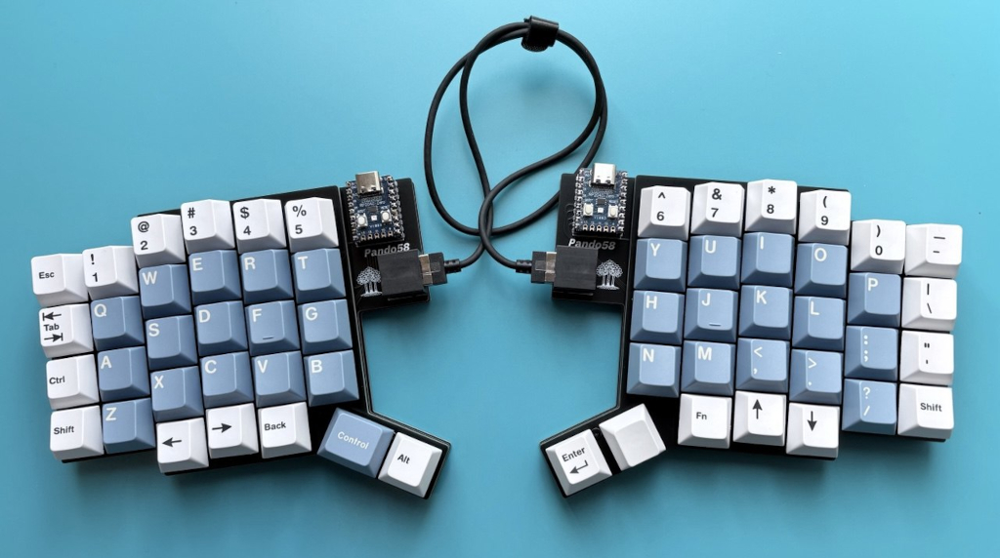
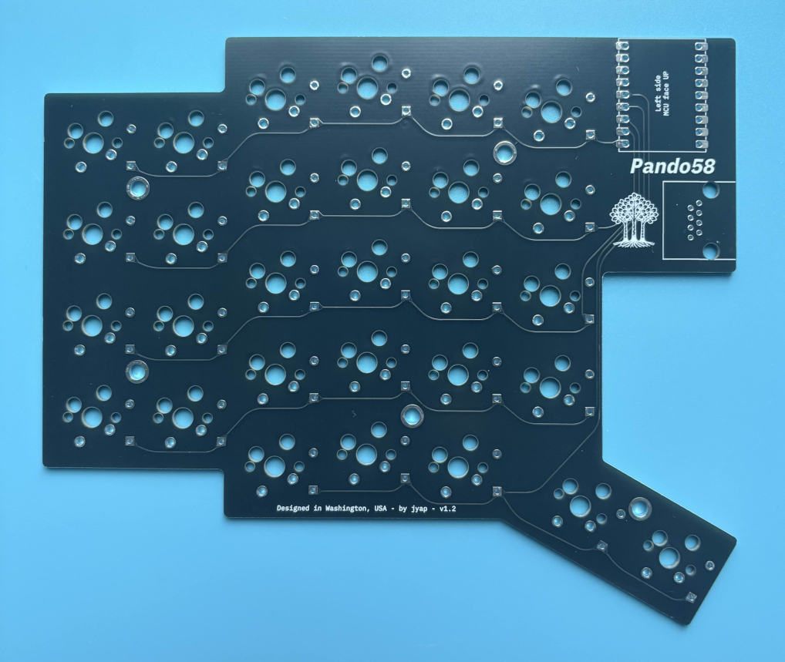
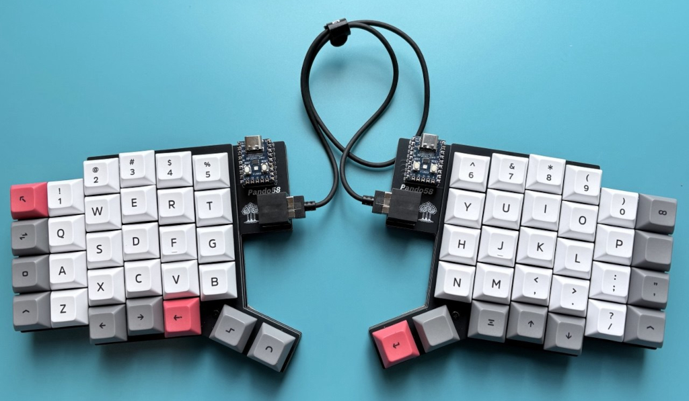
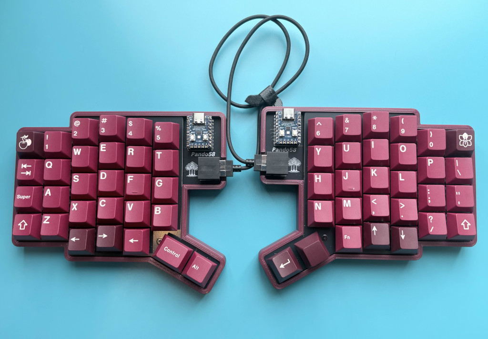
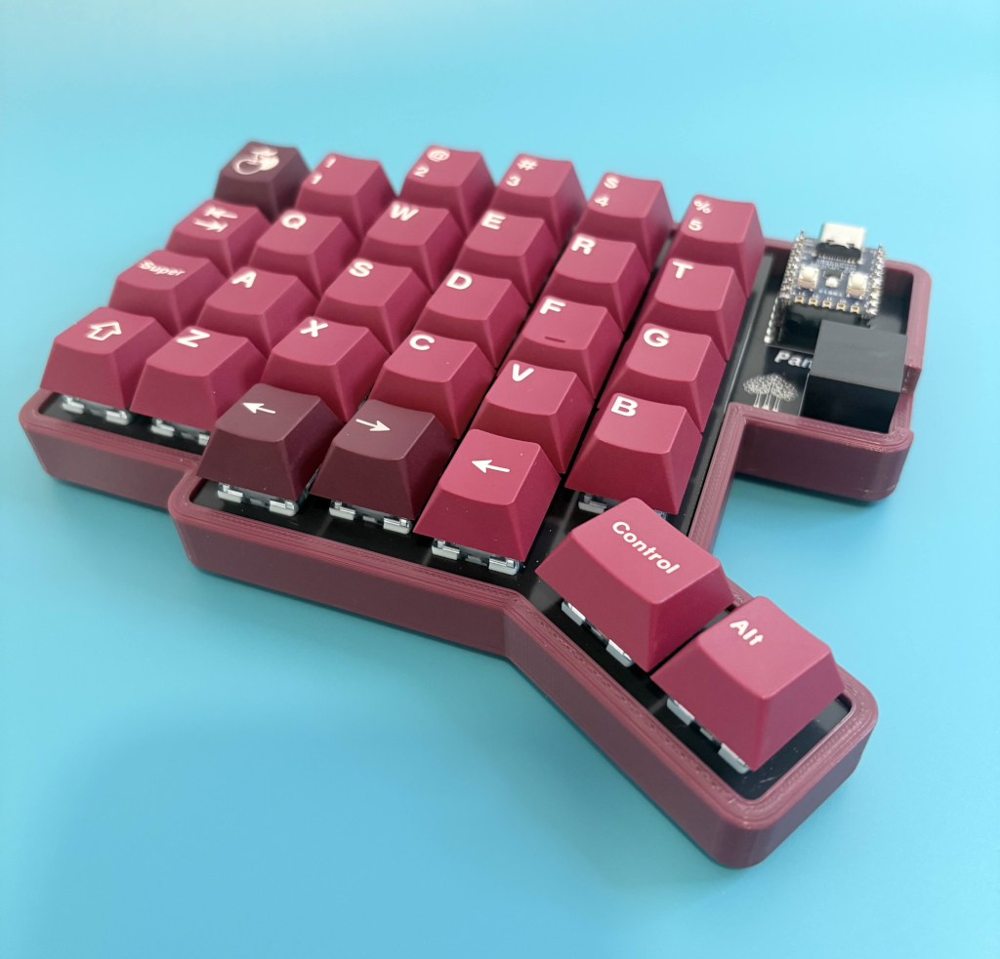
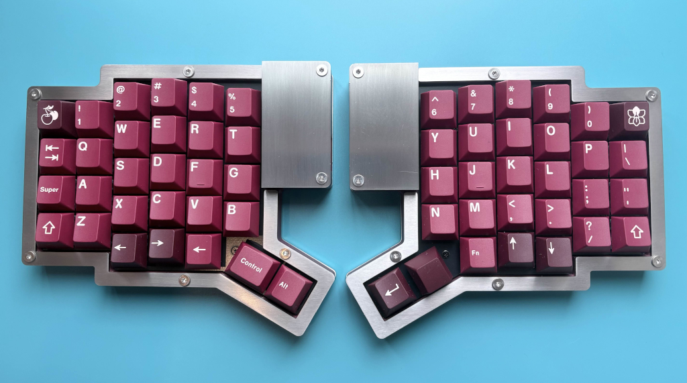
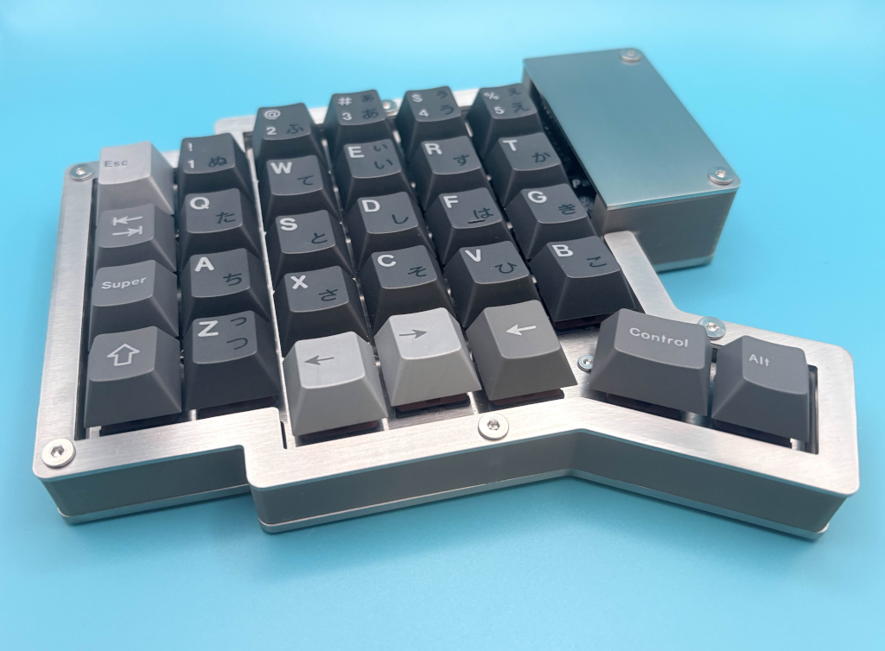

# Pando58

> 
> Pando58 + GMK Godspeed Colombia keycaps with Cherry Icebergo PBT modifier kit

Pando58 is a modern RP2040 Zero based 58-key column staggered split keyboard. The PCB supports hotswap sockets OR soldered switches. The interconnect uses RJ45 ports as opposed to TRRS, which improves reliability and allows for hotplugging.

> [!NOTE]
> 📘 The **[Documentation pages](https://jyap808.github.io/pando58)** contain a Bill of Materials, Build guide, Firmware guide and Gallery.

> [!TIP]
> 🚀 Want to build one? Official PCB sets and full DIY kits are available on [Etsy](https://www.etsy.com/listing/4478359437/). Your support helps me keep this project open-source and encourages the development of new models!

## ⌨️ Overview

- **Layout:** Split ergonomic, 58 keys total  
- **Split connection:** RJ45 (no TRRS)  
- **MCU:** 2× RP2040 Zero  
- **Firmware:** Vial  

## 💡 Design Philosophy

Pando58 was designed to avoid unnecessary complexity and common failure points found in many split keyboards.

### Why RJ45 instead of TRRS?

TRRS cables are widely used in split keyboards, but they have a major drawback:

- ❌ **Not hot-plug safe** — plugging or unplugging can short pins and damage MCUs

Pando58 uses **RJ45** to solve this:

- ✅ Hot-plug safe
- ✅ Mechanically robust
- ✅ Readily available cables and plugs
- ✅ Clear pin separation and predictable wiring

## 🟢 Electronics

- **MCUs:** 2× RP2040 Zero  
- **PCBs:** Dedicated left and right designs (not reversible)

### Why dedicated PCBs?

Reversible PCBs often introduce increased chance of assembly errors.

Pando58 intentionally uses **separate left and right PCBs** to:
- Simplify assembly
- Reduce mistakes
- Improve electrical clarity

## ⚡ Switch & Diode Support

Pando58 is designed to accommodate different builder preferences and budgets:

- **MX switches**
- **Hot-swap sockets** (optional)
- **Solder-only sockets** (no hot-swap sockets required)
- **Diodes**
  - Supports **SMT diodes**
  - Supports **through-hole diodes**

Choose the configuration that best fits your workflow and tooling.

## 💾 Firmware

- **Vial firmware provided** (see `keyboards/` directory)
- Instant key remapping
- No recompiling required
- Works out of the box once flashed
- Compiled firmware available in [Releases](https://github.com/jyap808/pando58/releases)

## 📦 Case Options

Pando58 is intentionally flexible in enclosure options:

### FR4 Sandwich Case

- Minimal
- Affordable
- Easy to manufacture
- Gerber files are available in [Releases](https://github.com/jyap808/pando58/releases)

### 3D-Printable Case

- Allows experimentation with angle and height
- Source FreeCAD file in `case/` directory
- Ready-to-print STL available on [Printables](https://www.printables.com/model/1647072-pando58-case)

## 🛠️ Tooling & Design

- Generated using **Ergogen**
- Custom footprints created for:
  - RJ45 connector
  - RP2040 Zero (heavily modified from existing designs)

## 📷 Photos

Additional photos are available in the [Gallery](https://jyap808.github.io/pando58/gallery).

Left PCB top side

Standard layout build with DSA Way keycaps

3D printed case with Keykobo Cherries

3D printed case - left half

Custom stainless steel and 3D printed case - Keykobo Cherries with 40s set keycaps

Custom stainless stell and 3D printed case - left half. Keykobo Nichirin with 40s set keycaps

## 📄 License

[Pando58 Keyboard](https://github.com/jyap808/pando58) © 2026 by [Julian Yap](https://julianyap.com/) is licensed under [CC BY-SA 4.0](http://creativecommons.org/licenses/by-sa/4.0/?ref=chooser-v1)
