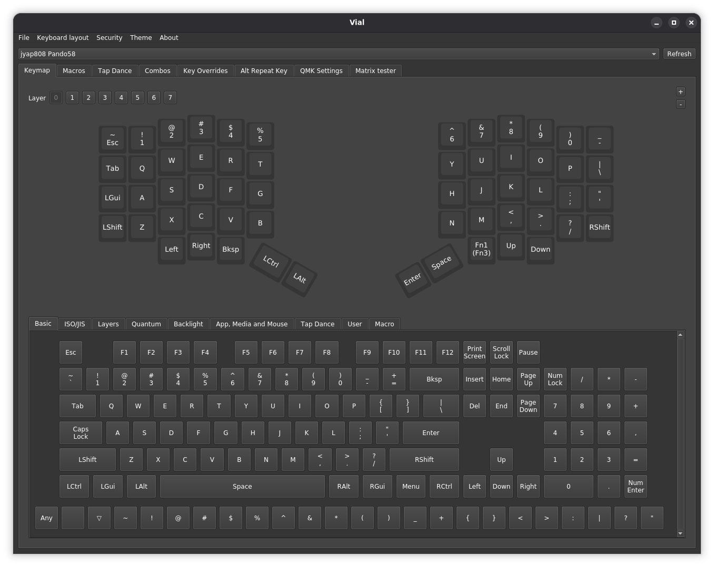

# Firmware

Pando58 uses Vial firmware which needs to be installed on the RP2040 Zero MCUs. Once installed, [Vial](https://get.vial.today/) (the application) is used to configure the keyboard.

## Getting Vial

Download Vial (the desktop application) from the [official website](https://get.vial.today/) for your platform.

Alternatively, you can use [Vial Web](https://vial.rocks) in your browser — no download required.

## Installing Firmware

There are two ways to get the latest Vial firmware for Pando58:

> **Note:** Pando58 is a split keyboard with an MCU on each half. Both MCUs will need to be flashed with the Vial firmware.

1. **Easy method** — Download precompiled firmware from [GitHub Releases](https://github.com/jyap808/pando58/releases) and flash via drag-and-drop (recommended for most users).
2. **Manual build method** — Clone the vial-qmk repo, build locally, and flash via CLI.

### Easy Method: Download from Releases + Drag-and-Drop

1. Go to the [Releases page](https://github.com/jyap808/pando58/releases)

2. Download the latest `.uf2` file (e.g., `jyap808_pando58_vial.uf2`)

3. Put the keyboard into bootloader mode by holding the BOOT button on the MCU while plugging in the USBC cable. The keyboard should mount as a removable drive (e.g., "RPI-RP2", "PICO", or similar).

4. Drag the downloaded `.uf2` file onto the mounted drive

5. The drive will auto-eject and the keyboard will reboot with the new firmware

### Manual Build Method: CLI Build + Flash (Advanced)

1. Clone the official Vial QMK fork:

        git clone https://github.com/vial-kb/vial-qmk.git
        cd vial-qmk

2. Initialize submodules (important for QMK dependencies):

        make git-submodule

3. Clone or download the Pando58 keyboard folder from the [GitHub repo](https://github.com/jyap808/pando58).

    Copy the entire `keyboards/jyap808/pando58/` folder into `vial-qmk/keyboards/jyap808/pando58/`.

4. Compile the Vial firmware:

        make jyap808/pando58:vial

    This produces `jyap808_pando58_vial.uf2`.

5. Flash using the CLI:

        qmk flash jyap808_pando58_vial.uf2

    Make sure you're in the directory with the `.uf2` file, or use the full path.

## Configuring with Vial

Open [Vial](https://get.vial.today/) to configure the keyboard. The Pando58 should connect automatically when the firmware is installed.

Vial allows you to remap keys, create layers, and configure macros for your Pando58 keyboard.
