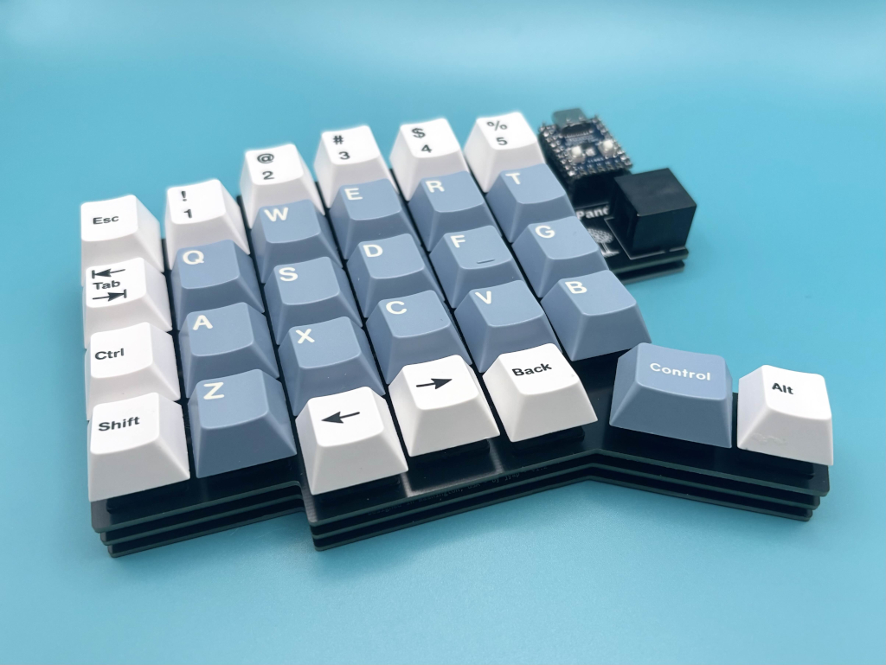
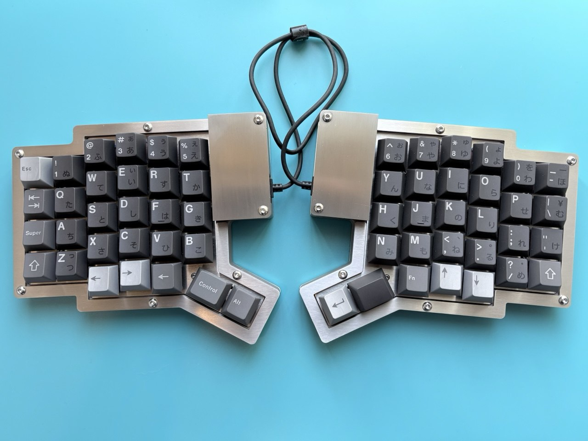
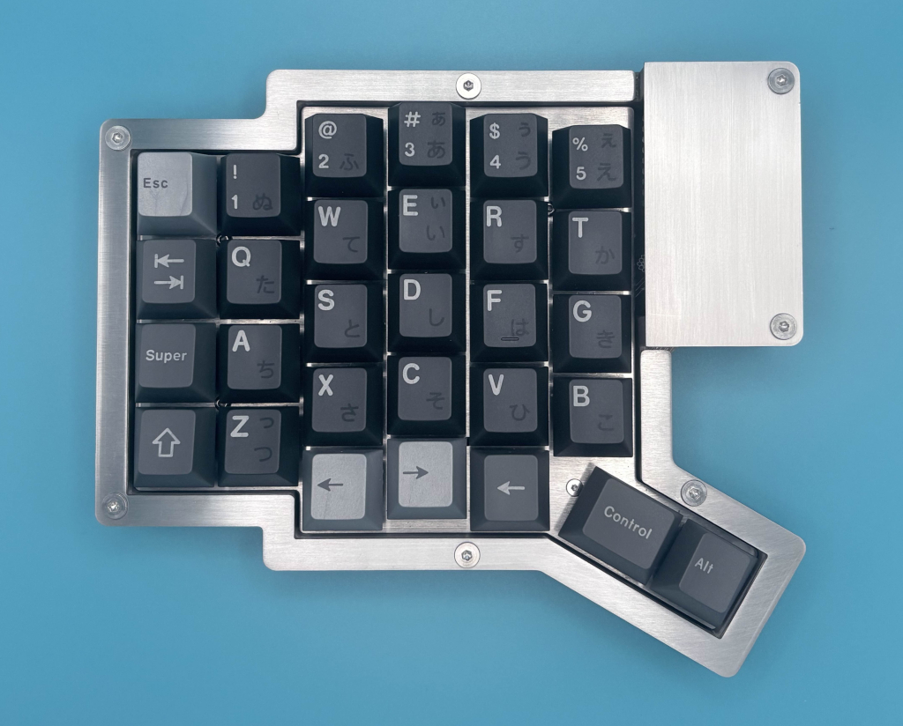
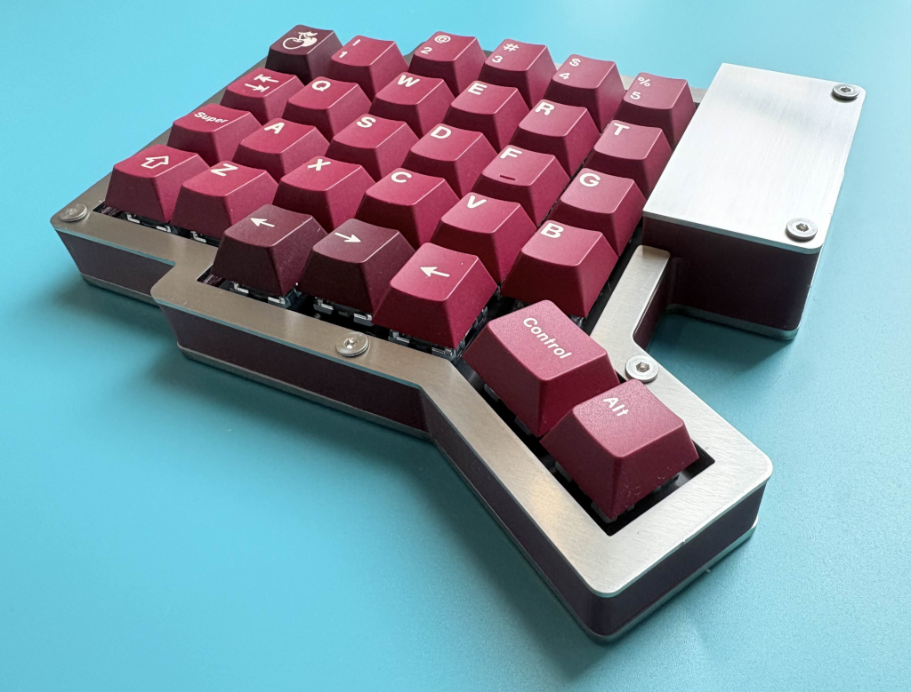
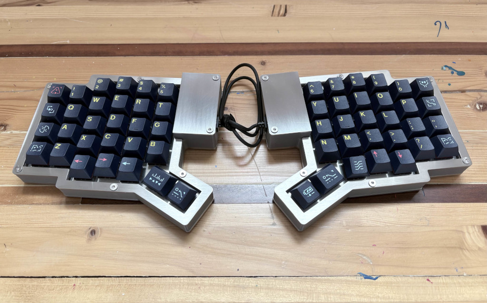
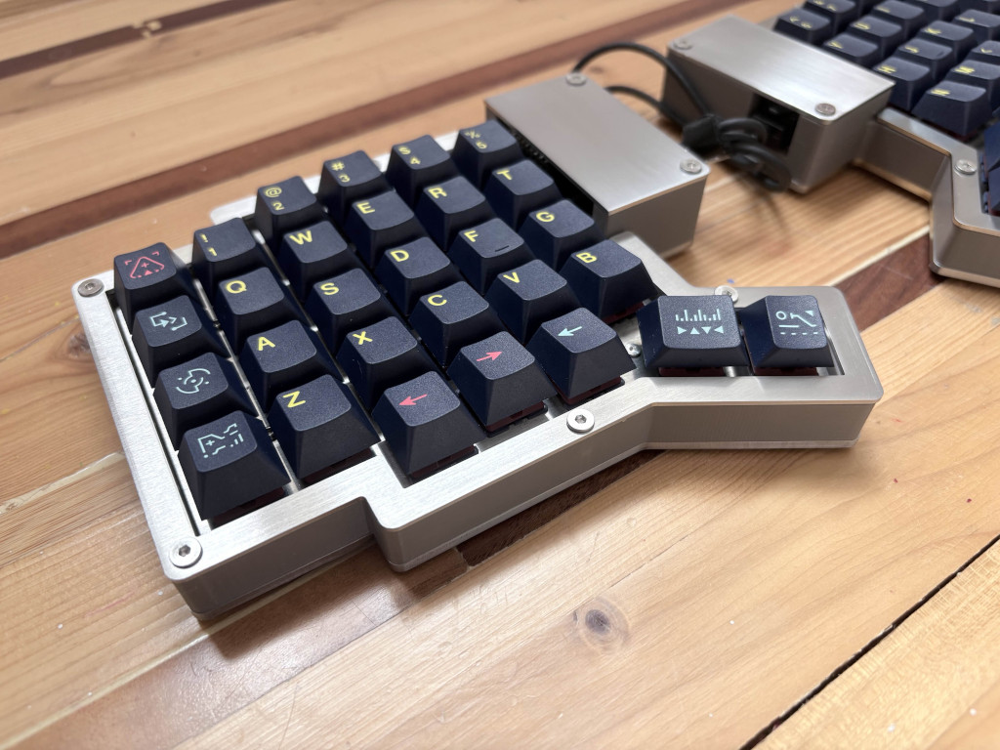

# Gallery

Pando58 supports a variety of case and keycap options. Here are some examples to inspire your build.

## Case Options

### Standard Layered Build

DSA Way keycaps in red accents by FK Keycaps. DSA is a uniform keycap height.

GMK Godspeed Colombia keycaps with Cherry Icebergo PBT modifier kit keycaps (from keeb.io).

The same build from a different angle showing the left half.

### 3D Printed Case

[3D printable case](https://www.printables.com/model/1647072-pando58-case) for Pando58 keyboard.

This replaces the default FR4 bottom piece. The assembled keyboard uses: switch plate + PCB + bottom case (this piece).

Keykobo Cherries with 40s set keycaps, printed with Ambrosia ASA filament in cardovan.

The same build from a different angle showing the left half.

### Custom Case Build

This is my custom case build made from stainless steel sheet metal mixed with 3D printed case.

Keykobo Nichirin with 40s set keycaps.

The same build from a different angle showing the left half.

The same build from a top view showing the left half.

Keykobo Cherries with 40s set keycaps.

The same build from a different angle showing the left half.

GMK Awaken keycaps.

The same build from a different angle showing the left half.
